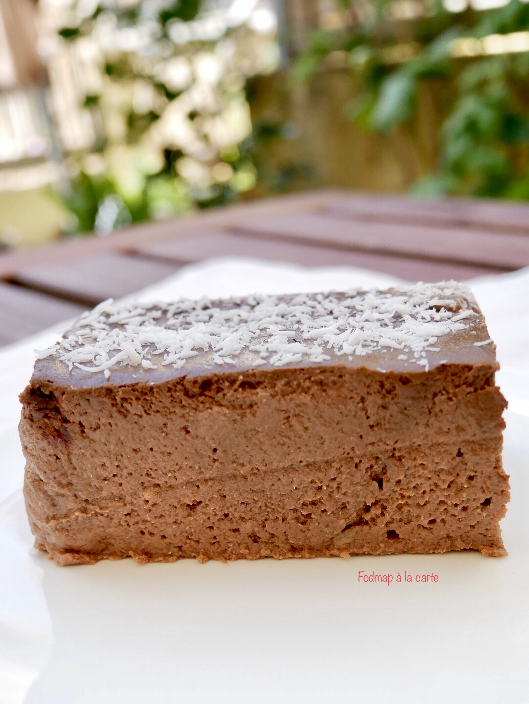

# Flan banane chocolat
### protéiné, sans farine, sans gluten, sans sucre, pauvre en fodmap, dessert, gâteau

## Ingrédients
- 4 bananes
- 400 ml de lait végétal (amande, riz…)
- 6 oeufs
- 55 g de farine de noix
- 25 g de farine de lin
- 2 c à s de cacao sans sucre
- Une pincée de sel
- un peu de vanille (facultatif)

## Étapes
Préchauffer le four à 180°C.

Ecraser les bananes. Dans un bol mélanger tous les ingrédients et mixer avec le mixeur plongeant.

Verser l’appareil à flan dans un moule allant au four, enfourner pour 40/45 minutes.

Laisser refroidir et mettre dans le frigo pour 2 heures.

Source: [https://fodmapalacarte.wordpress.com/2019/08/26/flan-banane-chocolat-proteine-sans-cereales-sans-farine-sans-gluten-sans-sucre-pauvre-en-fodmap/]()
