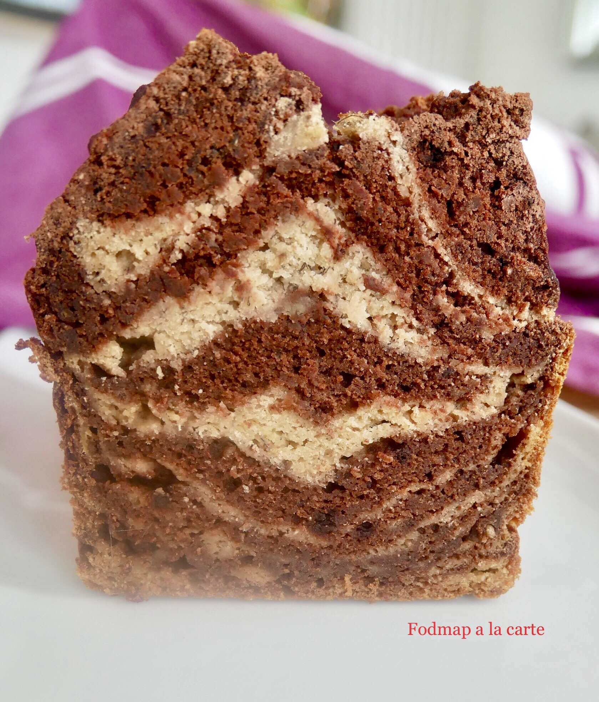

# Banana bread zebré chocolat
### sans gluten, pauvre en fodmap, dessert, gâteau

## Ingrédients

- 160 gr de farine de riz
- 50 gr de fécule de pomme de terre
- 35 gr de farine de coco
- 2 cc poudre à lever
- ½ cc bicarbonate alimentaire
- 3 bananes de taille moyenne
- 120 ml de lait de coco
- 3 cc de jus de citron
- 1 cs d’huile de coco fondu
- 1 cs de miso blanc (facultatif mais ca apporte un plus)
- facultatif: 1 œuf de chia (1 cc de graines de chia mixé + 3 cs d’eau tiède mélangé, on le fait prendre 15 min)

Pour la couche au cacao :
- 25 gr de cacao en poudre sans sucre
- 1 cs d’huile de coco fondu
- Quelques cs du lait de coco

## Étapes

Dans un petit bol mélanger le jus de citron, le poudre à lever et le bicarbonate alimentaire, le faire mousser.

Mettre le reste des ingrédients secs dans un bol et mélanger. Dans un robot mélanger les ingrédients humides.

Verser les ingrédients humides dans le bol avec les ingrédients secs. Y rajouter la mousse avec les poudres à lever.

Séparer le mélange en 2 bols, dans l’une rajouter le mélange pour avoir la couche au cacao. Mélanger bien.

Dans un moule à cake huilé ou recouvert de papier sulfurisé mettre une cs de la pâte au cacao, par-dessus une cs de couche de la pâte nature, et continuer ainsi jusqu’à l’épuisement des 2 pates à gâteau.

Dans un four préchauffé à 180°C enfourner pour 45/50 min, vérifier la cuisson avec la pointe d’un couteau.

Source: [https://fodmapalacarte.wordpress.com/2020/03/06/1879/]()
