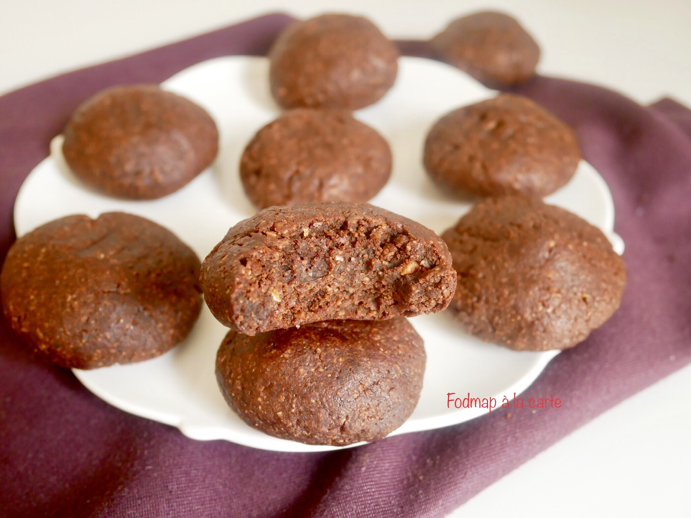

# Biscuits noisettes cacao
### sans gluten, pauvre en fodmap, dessert, gâteau, sans lactose, vegan

## Ingrédients

Pour une douzaine de biscuits:

- 150 g de noisettes entières torréfiées (ou d’amandes entières)
- 35 gr d’amandes entières torréfiées
- 100 g de sucre intégral
- 50 g de flocons d’avoine
- 30 g de cacao en poudre
- 20 g de graines de lin
- 120 g de lait de riz (ou d’un autre lait végétal : amande, noisette, avoine…)
- 40 g de farine de sarrasin
- 2 cuillères à café de poudre à lever
- 1 pincée de sel

## Étapes

Préchauffer le four à 180°.

Dans un robot, mixer les graines de lin. Y ajouter les flocons d’avoine pour obtenir une farine relativement fine. Réserver le mélange.

Mixer également finement les noisettes et les amandes.

Dans un bol, verser la farine de sarrasin, la farine d’avoine, la poudre de lin et celle de noisettes et d’amandes, le sucre intégral, le cacao en poudre, la levure et le sel.

Verser le lait de riz. Bien mélanger.

Etape facultatif : mettre la pâte dans le frigo pendant 1 heure.
Chemiser une plaque de four. Modeler des petits macarons en formant des petites boules de 20 g environ. Poser sur la plaque de four en appuyant légèrement et en espaçant les biscuits.

Enfourner pour 11 minutes environ.

Source: [https://fodmapalacarte.wordpress.com/2019/06/19/biscuits-gourmands-aux-noisettes-cacao-vegan-sans-beurre-sans-gluten-pauvre-en-fodmaps/]()
