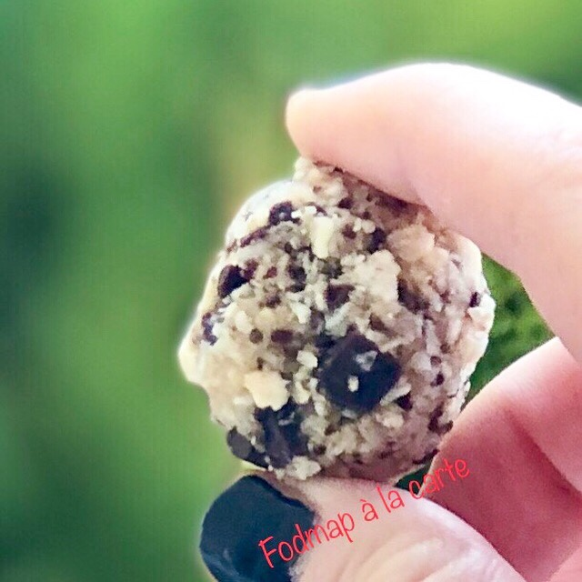

# Boule énergie banane chocolat
### sans gluten, sans lactose, pauvre en fodmap, goûter, dessert, encas

## Ingrédients
Pour 5/6 boules :

- 1/2 banane
- 1 c à c de chocolat noir concassé
- 2 c à s de flocons d’avoine ou de millet
- 1+1/2 c à c de noix de coco râpé ou 1 c à c de farine de millet brun
- 1 ou 2 c à s de riz soufflé sans sucre
- 1 c à c de graines de chia mixé
- Zeste de citron (facultatif)
- 1 c à c de baie de goji (facultatif)
- Pour les enrober : 1 à 2 c à s de noix de coco râpé ou graines de lin blond mixées

## Étapes
Écrasez la banane, mélanger tous les ingrédients, faites-en des petits boules (si vous n’arrivez pas former des boules rajouter un peu d’huile de coco).

Puis rouler dans la noix de coco râpé, les mettre sur du papier sulfurisé et mettre au réfrigérateur 1 heure.

On peut les consommer pendant 3/4 jours.

Source: [https://fodmapalacarte.wordpress.com/2019/03/14/energy-balls-banane-chocolat-sans-gluten-sans-lactose-pauvre-en-fodmaps/]()
