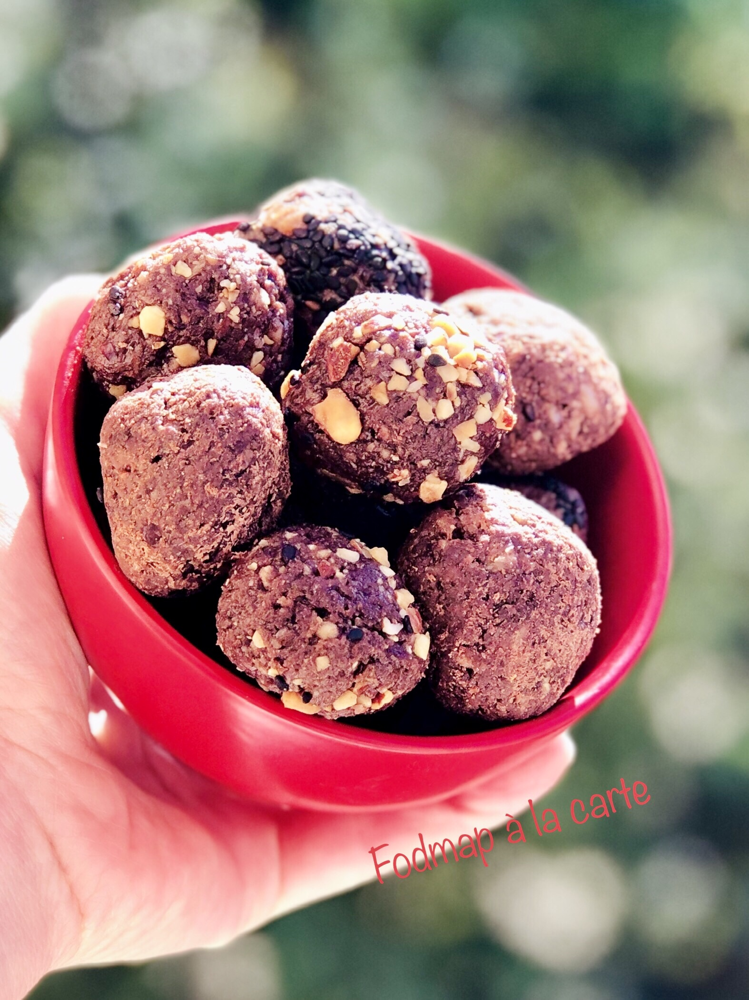

# Boule énergie chocolat cacahuètes
### sans gluten, sans lactose, pauvre en fodmap, goûter, dessert, encas

Ne pas dépasser 2 ou 3 boules pour que ça reste FODMAP.

## Ingrédients
Pour 4/5 boules :

- 1 c à s de noix de coco râpé
- 1 c à c de purée de cacahuète
- 2 c à c de graines de lin mixé
- ½ c à c de cacao sans sucre
- 1 c à s de sirop de coco ou de sirop d’érable
- 2 c à c de chocolat finement concassé
- 1 ou 2 c à s de riz soufflé sans sucre
- 1 c à s de canneberges séchées
- 1 pincée de sel
- Pour enrober : des noisettes, amandes concassées

## Étapes
Mixer grossièrement le riz soufflé et la noix de coco râpé dans le robot mixeur (étape facultative).

Rajouter le beurre de cacahuète, graines de lin, sirop d’érable, sel et chocolat. Mixer bien jusqu’à ce que tous les ingrédients se mélangent bien.

Relever avec une cuillère à café un peu du mélange, former des boules, si la texture est sèche rajouter un peu de sirop d’érable ou humidifier vos mains et rouler les boules avec vos mains bien mouillées.

Poser les energy balls sur du papier sulfurisé et mettre au réfrigérateur 1 heure.

On peut les consommer pendant 6 / 7 jours.

Source: [https://fodmapalacarte.wordpress.com/2019/03/11/energy-balls-au-chocolat-et-cacahuete-sans-gluten-sans-lactose-pauvre-en-fodmaps/]()
