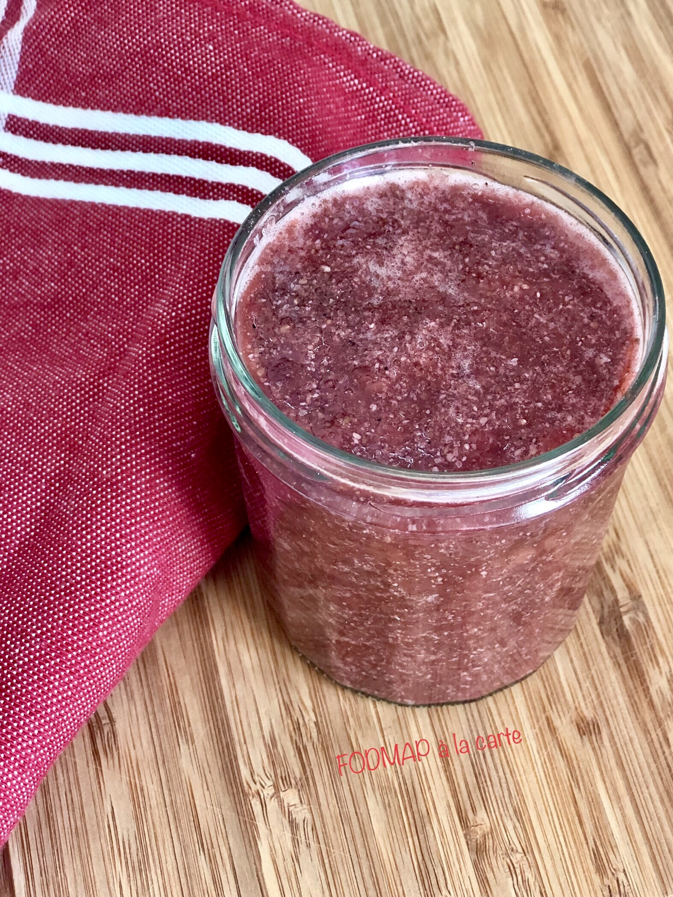

# Confiture fraise et chia
### sans gluten, pauvre en fodmap, dessert, gâteau, petit-déjeuner, rapide

## Ingrédients

- 250 gr de fraises surgelées
- 2 à 4 c à s de sirop d’érable
- 1 c à s du jus de citron
- De la vanille en poudre
- Une pincée de sel de mer
- 2 c à s de graines de chia mixé

## Étapes

Faire compoter les fraises à feu doux dans une casserole une dizaine de minutes. Avec le dos d’une fourchette, écrasez-les plus ou moins selon la texture souhaitée.

Hors du feu, incorporer le sirop d’érable, le jus de citron, la vanille, le sel. Incorporer les graines de chia, mélanger bien et laisser gonfler 5 minutes.

Laisser refroidir à température ambiante, puis verser dans un pot stérilisé. Rserver au frais (c’est le froid qui va épaissir votre confiture). Elle peut être gardée au frais une semaine.

Source: [https://fodmapalacarte.wordpress.com/2019/09/23/confiture-fraise-chia-rapide-et-pauvre-en-fodmaps-sans-gluten-sans-sucre-raffine/]()
