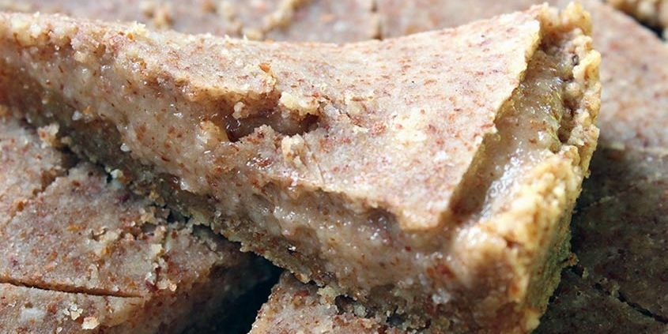

# Galette des rois crue et végétale

### sans gluten, pauvre en fodmap, plat, rapide

Temps de Préparation 20 minutes

Temps d'Attente	16 heures

Portions 8 personnes

## Ingrédients

**Pour le fond de la galette :**

- 50 gr de graines de lin blond
- 150 gr d'amandes entières
- 60 gr de sirop d’agave ou érable ou miel
- 60 gr d'eau

**Pour le dessus de la galette :**

- 150 gr d'amandes entières
- 60 gr de sirop d’agave ou érable ou miel
- 1 càc extrait d'amande amère
- 20 gr d'eau

**Pour la frangipane :**

- 120 gr d'amandes entières
- 80 gr de purée d'amandes
- 60 gr de sirop d’agave ou érable ou miel
- 60 gr d'eau

## Étapes

Préparez le fond de la galette : mettez à tremper les amandes la veille au soir dans de l’eau. Le lendemain, passez les graines de lin au blender pour les moudre. Réservez dans un saladier. Mixez ensuite le reste des ingrédients au blender et versez la préparation obtenue dans le saladier avec les graines de lin. Mélangez et étalez la pâte dans le fond d’un moule à charnière de 18-20 cm, en faisant des rebords (vous pouvez vous aider d’un peu d’eau sur vos doigts si la pâte colle et est difficile à étaler). Mettez à déshydrater pendant 16-18h à 42°C.

Préparez le dessus de la galette : réduisez en poudre les amandes à l’aide du blender, versez dans un saladier avec le reste des ingrédients et mélangez. Etalez cette pâte entre deux feuilles teflex (ou silicone ou papier cuisson réutilisable). Retirez la feuille du dessus doucement et mettez à déshydrater pendant 16-18h à 42°C.

Le lendemain, préparez la frangipane avant de dresser la galette : réduisez en poudre les amandes à l’aide du blender, versez dans un saladier avec le reste des ingrédients et mélangez. Tapissez le fond de la galette avec la frangipane. Déposez une noix du brésil en guise de fève. Et déposez le dessus de la galette sur la frangipane (que vous aurez préalablement découper du diamètre du fond de la galette). Vous pouvez dessiner des formes de votre choix sur le dessus. Dégustez de suite : une petite part suffit, ça cale bien !

Source: [https://regenerescence.com/recettes/galette-des-rois-crue-et-vegetale/]()
