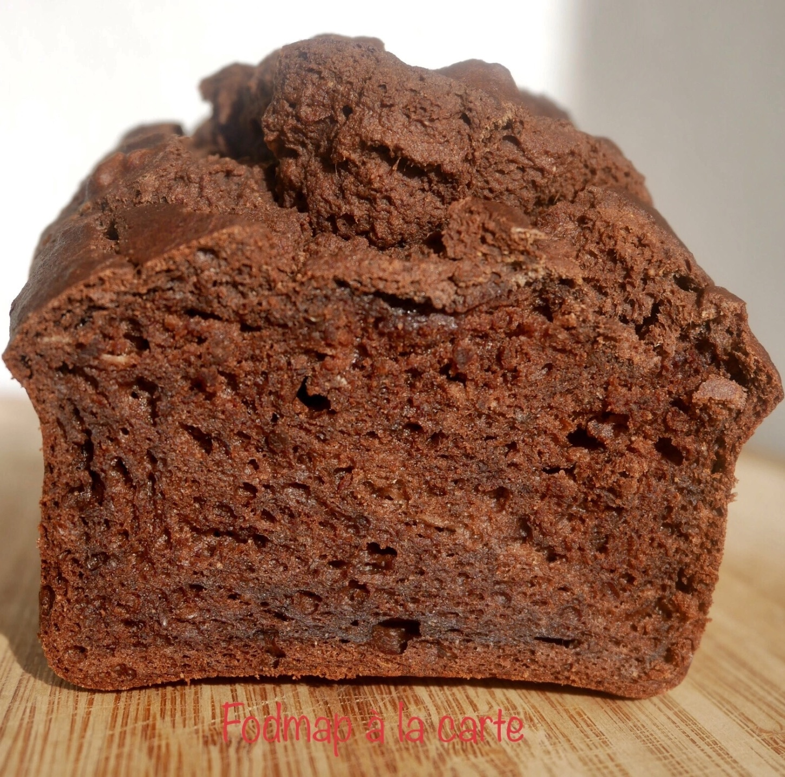

# Gâteau à la banane, chocolat et purée de cacahuète
### sans gluten, sans lactose, pauvre en fodmap, dessert, gâteau

## Ingrédients

- 2 œufs
- 3 bananes mûres (taille moyenne)
- 200 gr de farine de riz complet
- 60 gr de purée de cacahuète
- 25 gr de cacao sans sucre
- 15 cl de lait d’amande
- 2 c à c de graines de lin moulu
- 2 c à c de graines de chia moulu
- 1 c à c de poudre à lever
- 1/4 de c à c de bicarbonate alimentaire

## Étapes

Préchauffer le four à 160•C en chaleur tournant.

Écraser les bananes, puis dans un bol mélanger les bananes, les œufs et le lait végétal. Tout mixer avec le mixeur plongeant (ou si vous préférez sans mixeur mélanger) . Ensuite rajouter la purée de cacahuète et mélanger. Puis y ajouter les autres ingrédients.

Huiler un moule à cake et enfourner pour 40 minutes à peu près (vérifier la cuisson avec la pointe d’un couteau)

Source: [https://fodmapalacarte.wordpress.com/2020/03/06/1879/]()
