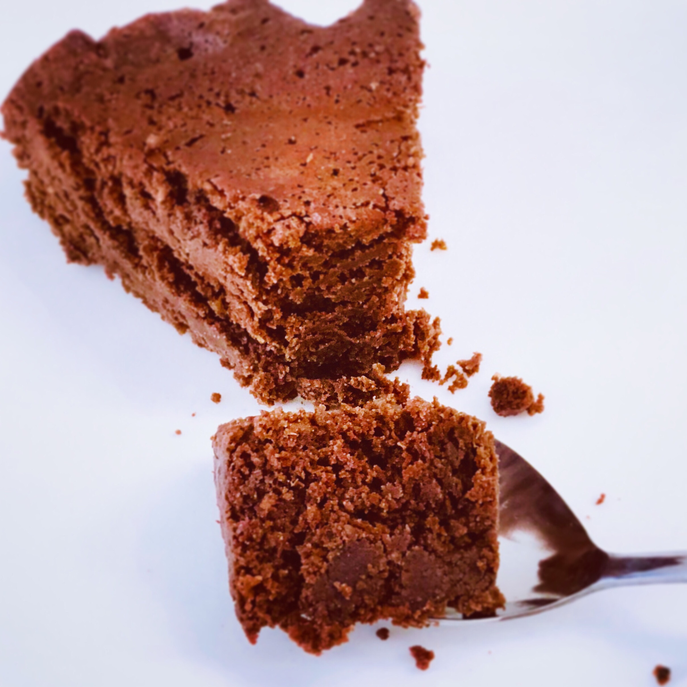

# Gâteau chocolat courgette
### sans gluten, pauvre en fodmap, dessert, gâteau

## Ingrédients

- 3 œufs (de taille petite)
- 2 courgettes pelées et vidées (ou une courgette entière)
- 2 verre de farine de riz complet
- 1 verre de fécule de pomme de terre
- 4 cuillère de cacao cru
- 1 verre de sucre de canne roux
- ½ verre de sirop d’érable
- 40 gr de chocolat dessert
- 5 gr de poudre à lever
- ½ c à c de bicarbonate alimentaire

## Étapes

Mélanger bien les œufs et le sucre pendant 5 minutes pour que le mélange double de volume. Y rajouter le sirop d’érable, mélanger à nouveau.

Puis rajouter le chocolat fondu et mélanger. Puis les courgettes râpées finement et mélanger de nouveau. Ensuite rajouter le cacao cru et homogénéiser.

Dans un bol verser la farine, le fécule, le poudre à lever et le bicarbonate. Verser le mélange sur l’appareil à gâteau et mélanger.

Huiler un moule de 18 cm de diamètre (huile de coco pour moi), verser l’appareil à cake, le couvrir de papier cuisson puis avec un papier aluminium pour le rendre hermétique (sinon l’eau va mouiller la pâte), remplir un fait-tout de l’eau, mettre le panier vapeur par-dessus, placer le moule et puis fermer le couvercle et cuire pour 40 minutes à la vapeur au feu doux.

Pour la version muffin au four ; four préchauffé à 180°C pendant 20/25 minutes.

Laisser refroidir et démouler.

Source: [https://fodmapalacarte.wordpress.com/2018/08/15/gateau-chocolat-courgette-au-cacao-cru-pauvre-en-fodmap-low-fodmap-chocolate-zucchini-cake-with-raw-cocoa/]()
