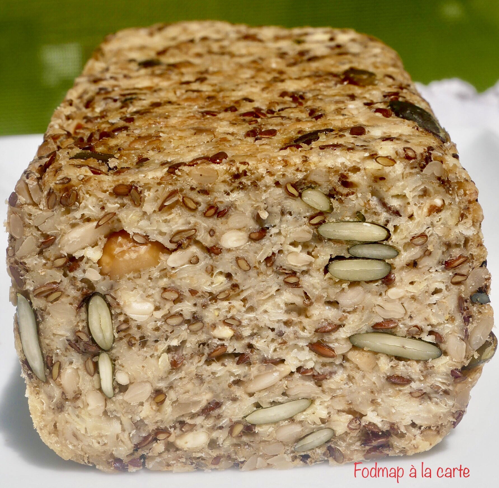

# Pain sans farine
### sans gluten, pauvre en fodmap, pain, rapide, apéritif

## Ingrédients

- 100 g de flocons de millet
- 80 g de flocons d’avoine sans gluten
- 20 g de psyllium blond
- 1 cc de sel
- 2 cs de graines de chia moulues
- 60 g de graines de tournesol
- 60 g de graines de courge
- 40 g de graines de lin
- 400 ml d’eau
- 4 c. à soupe d’huile d’olive

## Étapes

Mettre tous les ingrédients dans un saladier dans l’ordre indiqué. Chemiser d’une feuille de papier sulfurisé un moule à cake et y verser la pâte. Tasser bien la pâte avec vos mains. Laisser prendre au réfrigérateur 6 heures. Préchauffer votre four à 180° (th.6).

Enfourner le pain 30 minutes. Au bout des 30 minutes enlever le papier sulfurisé et retourner votre pain sur le papier sulfurisé et remettre à cuire pour 20 minutes. Laisser tiédir avant de le découper.

Vous pouvez le conserver 4/5 jours dans une boite hermétique ou le congeler en tranche pour manger plus tard.

Source: [https://fodmapalacarte.wordpress.com/2019/10/25/pain-facile-sans-farine-vegan-sans-levure-sans-gluten-sans-lactose/]()
