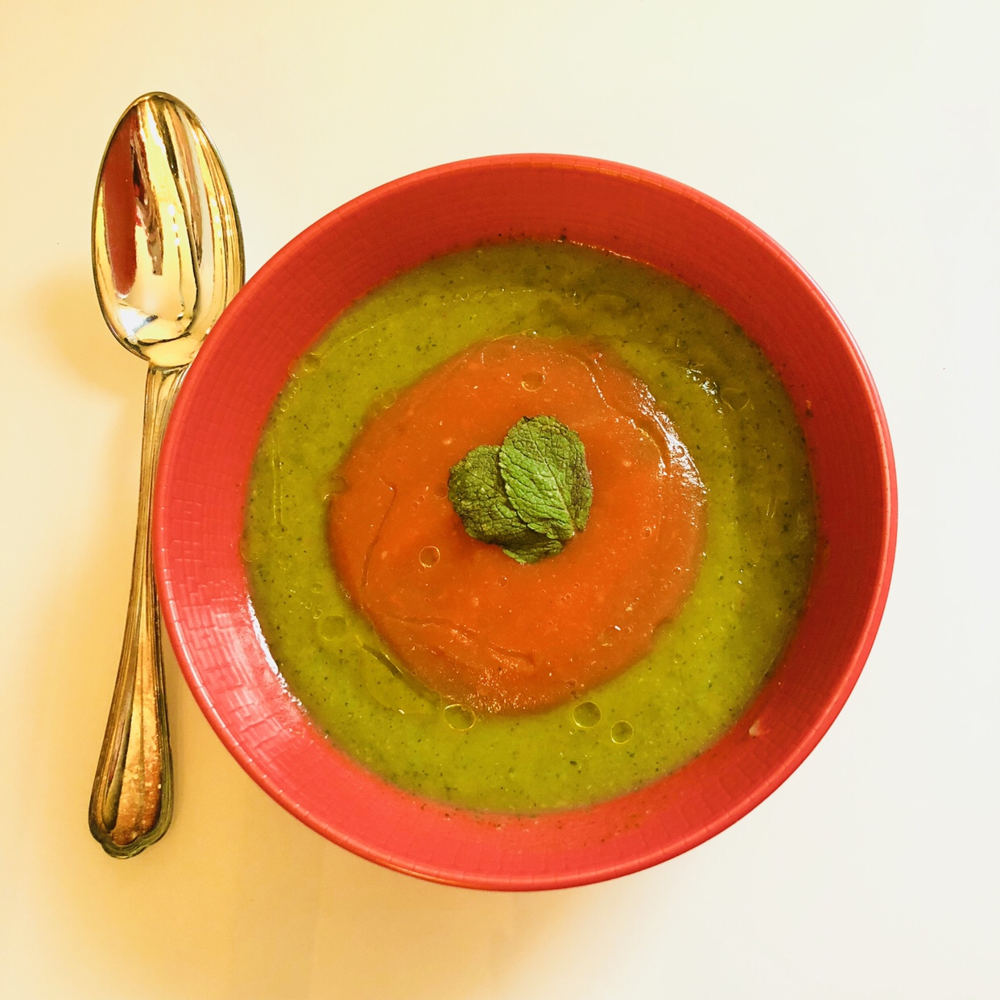

# Soupe froide courgette et tomate
### sans gluten, pauvre en fodmap, entrée

## Ingrédients

Pour 3/4 personnes

- 5 courgettes (de taille moyenne)
- 6 tomates grappes (de taille moyenne)
- Du paprika
- Du sel
- 3 cs d’huile d’olive
- Quelques feuilles de menthe fraiche

## Étapes
Laver bien les légumes.
Eplucher une bande sur 2 des courgettes.
Peler les tomates.

Cuire dans 2 paniers vapeurs distincts les courgettes d’une part et les tomates d’autre part pendant 15 minutes à peu près. Je les préfère bien fondantes.

Une fois cuit, enlever-les du panier vapeur, les mettre dans un récipient et avec un mixeur plongeur mixer les courgettes si nécessaire en ajoutant de l’eau (qui n’est pas l’eau de cuisson car dans un régime pauvre en FODMAP il vaut mieux ne pas consommer l’eau de cuisson des légumes. Je n’ai pas ajouté d’eau pour ma soupe car je voulais une texture veloutée et épaisse). Faire la même chose pour les tomates.

Dans chaque soupe rajouter une c à s d’huile d’olive, du sel et du paprika mélanger bien.

Servir dans un bol en mettant à peu près 100gr soupe de courgette et par-dessus mettre 50 gr de soupe de tomates en décorant avec quelques feuilles de menthe et en mettant ½ c à c d’huile d’olive.

Source: [https://fodmapalacarte.wordpress.com/2018/06/05/soupe-froide-de-courgettes-et-de-tomates/]()
